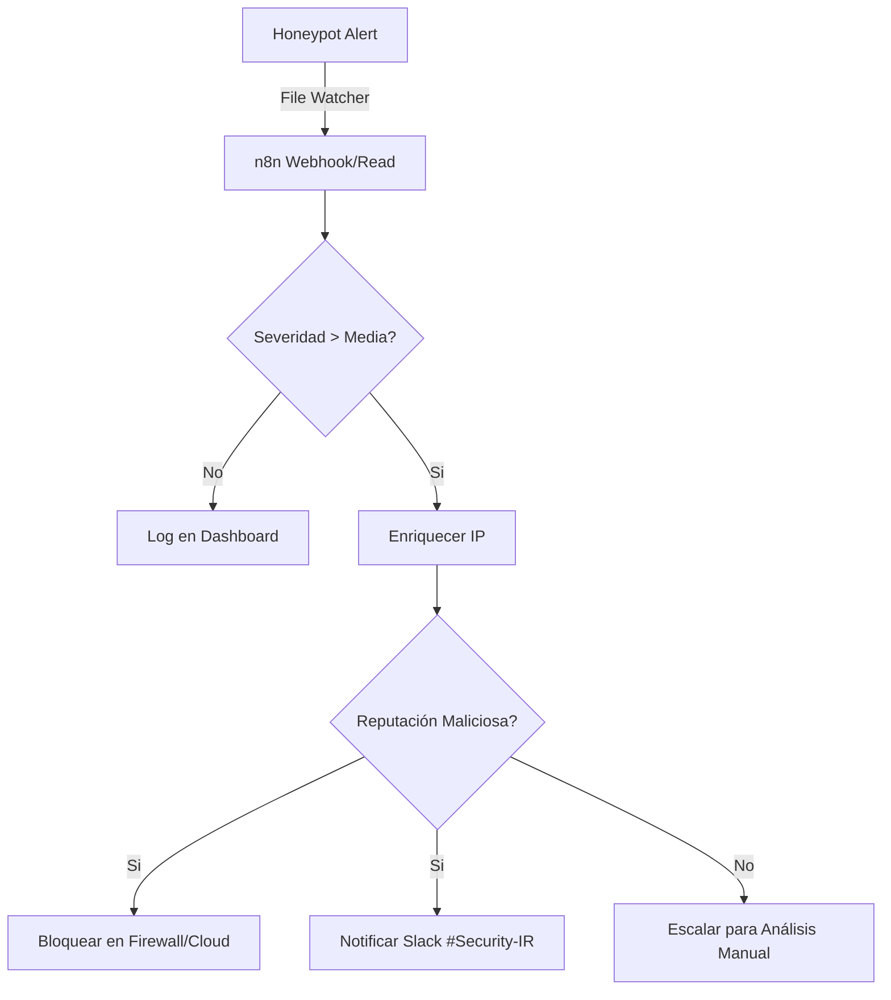

# 🛡️ SOC Laboratory: L1 Detection & Response

### Entorno de Simulación de Incidentes y Automatización (SOAR-Ready)

Este proyecto sirve como demostración técnica de capacidades de **Analista L1**, enfocado en la detección proactiva de amenazas y la orquestación de respuesta.

---

## 🎯 Escenario del Laboratorio
El sistema despliega un **Honeypot** (sensor de engaño) que expone un servicio web vulnerable. Cualquier interacción con este sensor es registrada y analizada por un motor de reglas en tiempo real.

---

## 🏗️ Componentes Técnicos

1.  **Honeypot Sensor (`honeypot.py`)**:
    - Servicio Python escuchando en el puerto 8080.
    - **Signatures Engine**: Motor de expresiones regulares para detectar SQLi, XSS, Path Traversal e inyección de comandos.
    - **Syslog-Format Logging**: Generación de logs estructurados listos para ser ingeridos por un SIEM (Wazuh/Elastic).

2.  **L1 Alerting Logic**:
    - Clasificación de severidad basada en el tipo de ataque.
    - Detección de patrones de comportamiento (ej: reconocimiento de directorios).

3.  **Respuesta Automatizada (Propuesta n8n)**:
    - Ver el diagrama conceptual abajo de cómo se integra con un flujo de **Incident Response**.

---

## 📊 Metodología de Triaje L1

Ante una alerta generada por este script, el flujo de trabajo documentado en este repo es:

1.  **Validación**: ¿Es un falso positivo? (ej: un scanner de vulnerabilidades interno).
2.  **Enriquecimiento**: Obtención de Whois/Reputación de la IP atacante vía APIs externas (VirusTotal/AbuseIPDB).
3.  **Contención**: Si la IP es maliciosa y la severidad es HIGH, se procede al bloqueo automático.
4.  **Escalado L2**: Si se detecta persistencia o técnicas avanzadas (C2 beaconing), se escala al equipo de L2 con el reporte generado.

---

## ⚙️ Cómo ejecutar el Laboratorio

1.  **Encender el Sensor**:
    ```bash
    python app/honeypot.py
    ```

2.  **Simular Ataques (Inyección SQL)**:
    ```bash
    curl "http://localhost:8080/search?id=' union select null,null--"
    ```

3.  **Simular Ataque (Lectura de Archivos del Sistema)**:
    ```bash
    curl "http://localhost:8080/../../etc/passwd"
    ```

4.  **Revisar el Log Forense**:
    Consulta `data/soc_alerts.log` para ver las trazas en formato profesional.

---

## 🔗 Automatización con n8n (Diagrama Conceptual)



---

## 🏷️ Conceptos L1 Aplicados
- **IOCs**: Indicadores de Compromiso detectados en los payloads.
- **Triaje**: Clasificación rápida de eventos por severidad.
- **SOAR**: Automatización de la respuesta ante incidentes (simulado con n8n).
